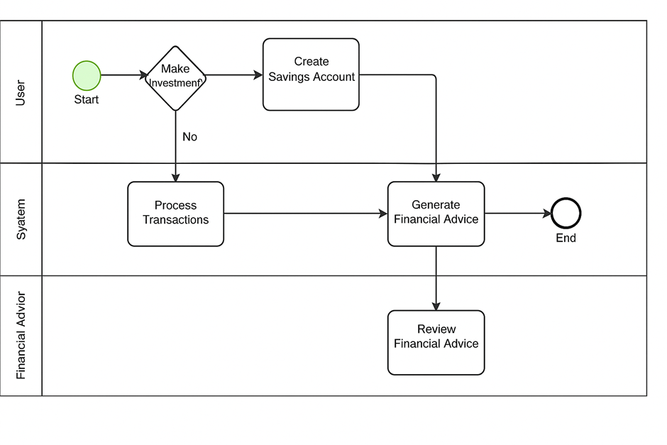
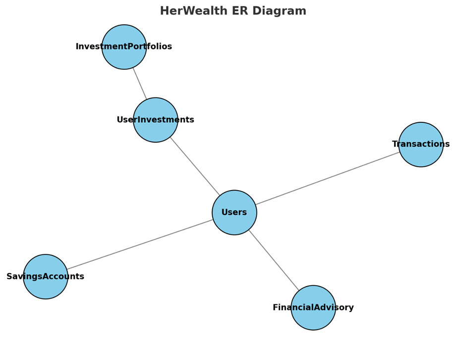

# HerWealth Capstone Project

## 📋 Problem Statement

Women in informal sectors and community savings groups face significant challenges:

* **Access Barriers:** Limited access to formal banking services.
* **Manual Processes:** Savings and investments tracked on paper or spreadsheets prone to errors.
* **Lack of Personalization:** No real-time, tailored financial advice.
* **Compliance Risks:** Inability to enforce transaction rules or audit data integrity.

**HerWealth** addresses these gaps by providing an integrated digital platform that automates savings, enables micro-investments, offers AI-driven advisory, and enforces security policies at the database level.

---

## 🚀 Methodology & Approach

We followed an iterative, phased approach aligned with Software Engineering best practices:

### **Phase II: Business Process Modeling**

* **Objective:** Visualize user-system interactions.  
* **Deliverable:** BPMN diagram (see below) with swimlanes for:

  * **User:** Registration, decision paths, account setup.  
  * **System:** Automated transactions, fraud checks, AI advisory.  
  * **Advisor:** Human review of AI insights.  
* **Key Elements:** Start/End events, decision gateways, tasks, data flows.




### **Phase III: Logical Data Design**

* **Objective:** Define a 3NF-compliant data model.
* **Entities & Attributes:**

  1. **Users** (`UserID`, Name, Email, Phone, KYCStatus)
  2. **SavingsAccounts** (`AccountID`, UserID, AccountType, GoalAmount, CurrentBalance)
  3. **InvestmentPortfolios** (`PortfolioID`, Name, Category, RiskLevel, ReturnRate)
  4. **UserInvestments** (`InvestmentID`, UserID, PortfolioID, AmountInvested)
  5. **Transactions** (`TransactionID`, UserID, SavingsAccountID, Type, Amount)
  6. **FinancialAdvisory** (`AdviceID`, UserID, AdviceText, AdviceType)
* **Deliverable:** ERD (`phase3/ERD.png`) with PK/FK relationships and constraints.


### **Phases IV & V: Database Creation & Table Implementation**

* **Objective:** Deploy physical schema and populate data.
* **Environment:** MySQL Workbench simulating Oracle PDB.
* **Actions:**

  * **Database:** `grpE_24752_Mitchelle_HerWealth_DB`, user `mitchelle` with full rights.
  * **Tables:** Created six tables with appropriate data types, NOT NULL, UNIQUE, CHECK constraints.
  * **Data Insertion:** Inserted 40+ realistic records (individual & group savings, investments, transactions, advisory).
* **Deliverables:**

  * Scripts: `/phase4/db_creation.sql`, `/phase5/table_creation.sql`, `/phase5/data_insertion.sql`
  * Screenshots: `Screenshots/DatabaseList.png`, 

### **Phase VI: Database Interaction & Transactions**

* **Objective:** Demonstrate DML, DDL, modular routines.
* **Procedures & Functions:**

  * `GetUserSavings(IN userID)`: Fetch user’s savings accounts.
  * `GetTotalSavings(userID)`: Aggregate savings balance.
  * `PrintAllUsers()`: Cursor-driven iteration with exception handler.
* **Schema Changes:** Added `CreatedAt` timestamp to `Users` via `ALTER TABLE`.
* **Deliverable:** `/phase6/interaction.sql`, screenshot: `screenshots/

### **Phase VII: Advanced Programming & Auditing**

* **Objective:** Enforce security/compliance rules and audit actions.
* **Components:**

  1. **Holidays Table:** Upcoming-month dates for holiday blocking.
  2. **AuditLog Table:** Records UserID, TableName, Operation, Status, Timestamp.
  3. **Audit Procedure:** `sp_insert_audit(...)` to insert into `AuditLog`.
  4. **Triggers:** BEFORE INSERT/UPDATE/DELETE on all tables:

     * Check `DAYOFWEEK` and `Holidays`.
     * `DENIED` triggers raise error + log; `ALLOWED` logs success.
* **Deliverable:** `/phase7/auditing_and_triggers.sql`, screenshots:

  * `screenshots/holidays_table.png`
  * `screenshots/audit_allowed.png`
  * `screenshots/denied_insert_error.png`
  * `screenshots/audit_denied.png`

---

## 📂 Repository Structure

```
/
├─ README.md               # This file
├─ phase2/                 # BPMN diagrams + docs
├─ phase3/                 # ERD + logical model
├─ phase4/                 # DB creation scripts
├─ phase5/                 # Table & data scripts
├─ phase6/                 # Interaction scripts
├─ phase7/                 # Auditing & triggers
└─ screenshots/            # Key screenshots
```
